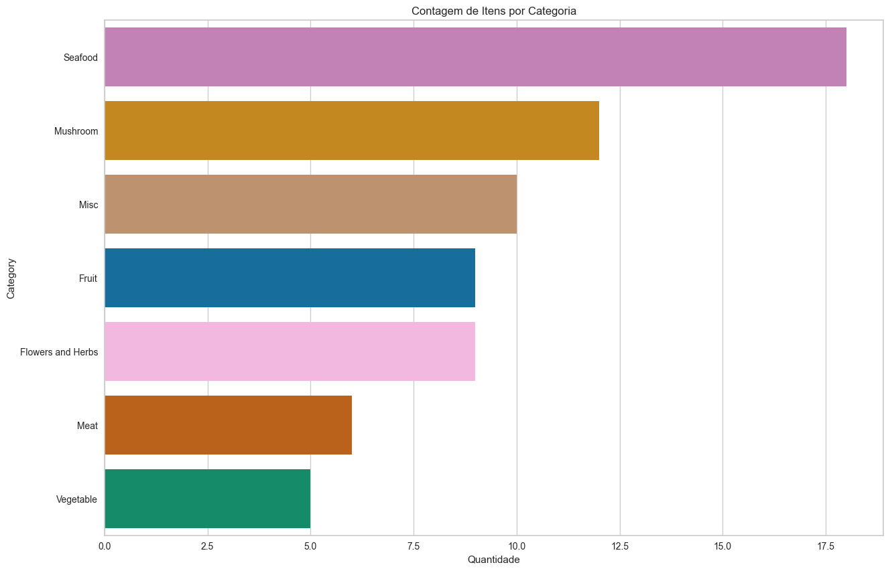
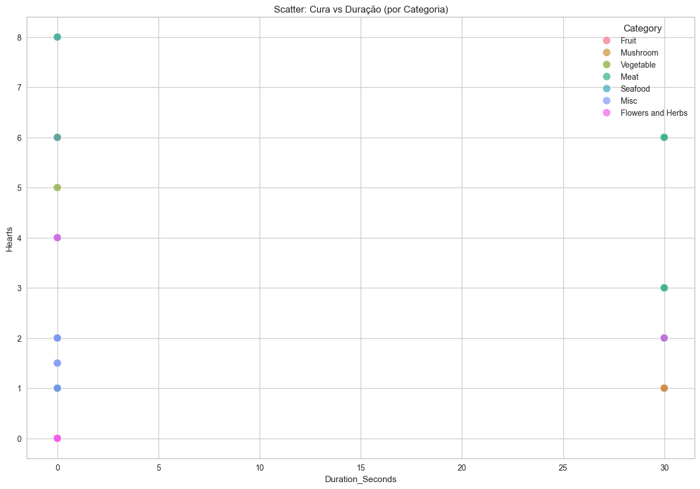
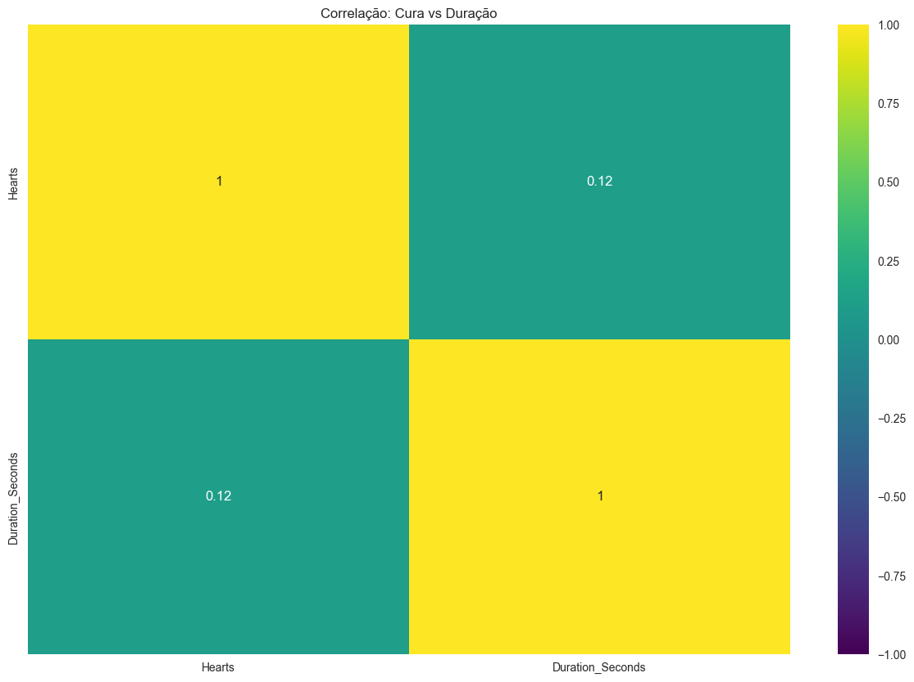
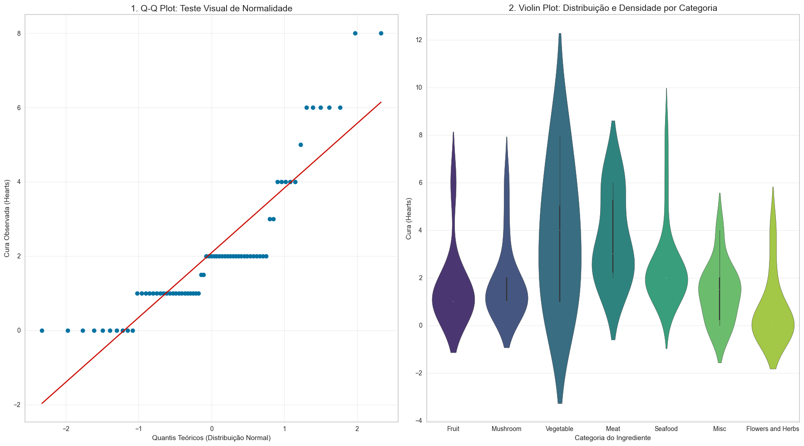
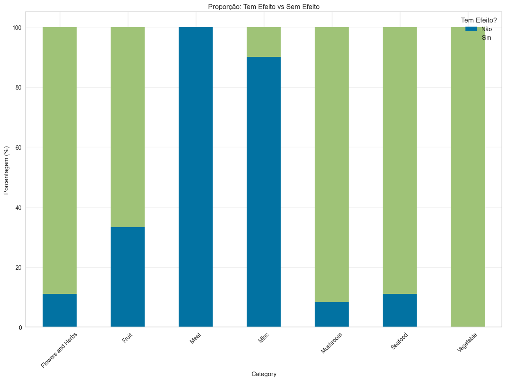
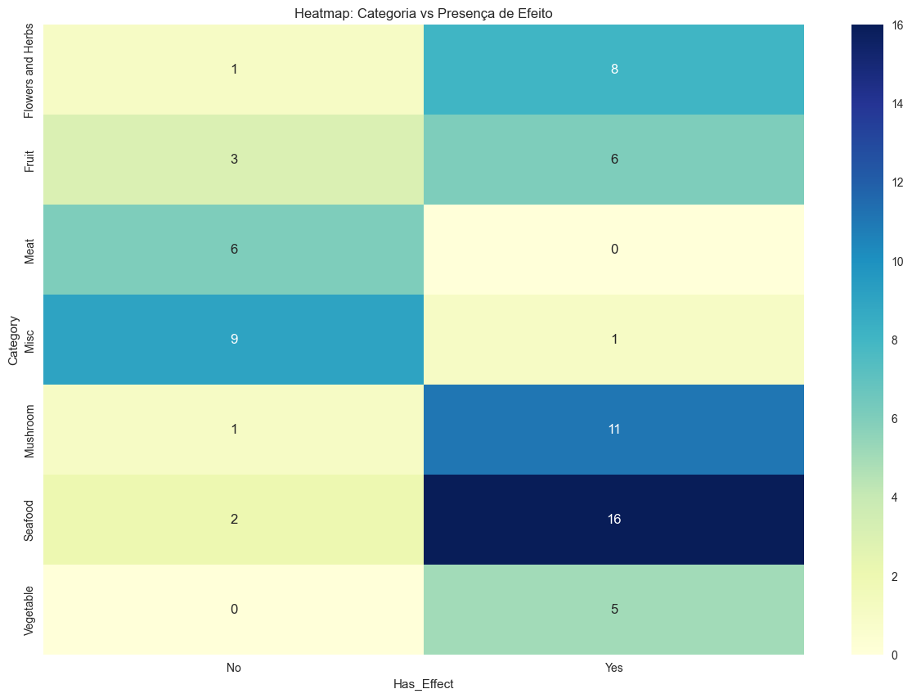
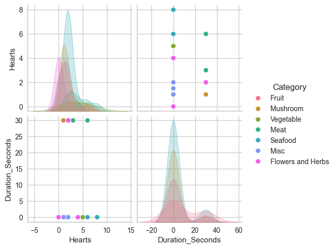
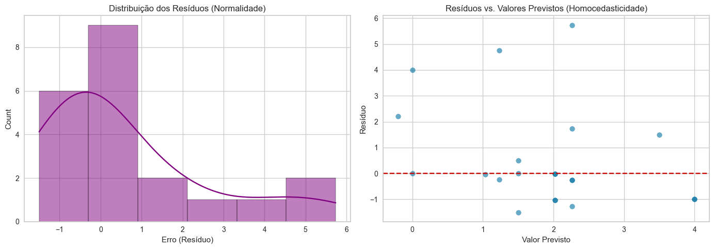

# Análise, Modelagem e Otimização das Comidas de Zelda BOTW

## 1. Introdução e Objetivos
Esse projeto analisa itens consumíveis do jogo The Legend of Zelda: Breath of the Wild. O objetivo é entender como os atributos dos ingredientes se relacionam com seus efeitos no jogo, utilizando algoritmos de Regressão e Classificação.

### 1.1. Fonte de Dados

* **Dataset:** Zelda Complete Food and Elixirs Dataset
* **Fonte:** [Zelda Complete Food and Elixirs Dataset](https://www.kaggle.com/datasets/pavlosnigur/zelda-botw-food-complete)
* **Descrição:** O dataset contém 69 entradas de ingredientes e alimentos, com atributos como nome, categoria, poder de cura (corações), efeitos especiais e duração.

### 1.2. Variáveis-Alvo
Conforme requisitado no projeto, abordaremos dois problemas de aprendizado supervisionado:

1.  **Regressão:**
    * **Target:** `Hearts` (Quantidade de cura).
    * **Objetivo:** Prever quantos corações um item cura com base em sua categoria, duração e tipo de efeito.
2.  **Classificação:**
    * **Target:** `Category` (Ex: Fruit, Meat, Mushroom).
    * **Objetivo:** Classificar o tipo do ingrediente com base em seus status numéricos e efeitos.

### 1.3. Hipóteses de Negócio
Para guiar a análise, formulamos as seguintes hipóteses sobre o balanceamento do jogo:

* **H1 (Regressão):** Itens com efeitos especiais poderosos (ex: "Hearty" ou "Mighty") tendem a ter valores de cura base (`Hearts`) mais altos do que itens sem efeito (neutros).
* **H2 (Classificação):** É possível distinguir "Carnes" de "Frutas" apenas observando a relação entre *Duração do Efeito* e *Quantidade de Cura*, pois carnes tendem a curar mais, mas ter durações diferentes de frutas.


```python
import pandas as pd
import seaborn as sns
import matplotlib.pyplot as plt
import numpy as np
import scipy.stats as stats
import statsmodels.api as sm
from sklearn.model_selection import train_test_split, GridSearchCV
from sklearn.metrics import mean_squared_error, r2_score, mean_absolute_error, accuracy_score, classification_report, precision_score, recall_score, f1_score, roc_auc_score, mean_squared_error, confusion_matrix
from sklearn.linear_model import LogisticRegression, Ridge
from sklearn.preprocessing import PolynomialFeatures, StandardScaler
from sklearn.pipeline import make_pipeline
from sklearn.naive_bayes import GaussianNB
from statsmodels.stats.outliers_influence import variance_inflation_factor
from pycaret.regression import setup as setup_reg, compare_models as compare_reg, tune_model as tune_reg, pull as pull_reg
```


```python
df = pd.read_csv('../data/zelda_food.csv')
```


```python
df.head()
```


<div>
<style scoped>
    .dataframe tbody tr th:only-of-type {
        vertical-align: middle;
    }

    .dataframe tbody tr th {
        vertical-align: top;
    }

    .dataframe thead th {
        text-align: right;
    }
</style>
<table border="1" class="dataframe">
  <thead>
    <tr style="text-align: right;">
      <th></th>
      <th>Class</th>
      <th>Subclass</th>
      <th>Material</th>
      <th>Hearts</th>
      <th>Effect class when cooked</th>
      <th>Bonus effect when cooked</th>
      <th>Duration increase</th>
    </tr>
  </thead>
  <tbody>
    <tr>
      <th>0</th>
      <td>Fruit</td>
      <td>Fruit</td>
      <td>Apple</td>
      <td>1.0</td>
      <td>NaN</td>
      <td>NaN</td>
      <td>0:30</td>
    </tr>
    <tr>
      <th>1</th>
      <td>Fruit</td>
      <td>Fruit</td>
      <td>Fleet-Lotus Seeds</td>
      <td>1.0</td>
      <td>Hasty</td>
      <td>NaN</td>
      <td>NaN</td>
    </tr>
    <tr>
      <th>2</th>
      <td>Fruit</td>
      <td>Fruit</td>
      <td>Hearty Durian</td>
      <td>6.0</td>
      <td>Hearty</td>
      <td>max</td>
      <td>NaN</td>
    </tr>
    <tr>
      <th>3</th>
      <td>Fruit</td>
      <td>Fruit</td>
      <td>Hydromelon</td>
      <td>1.0</td>
      <td>Chilly</td>
      <td>NaN</td>
      <td>NaN</td>
    </tr>
    <tr>
      <th>4</th>
      <td>Fruit</td>
      <td>Fruit</td>
      <td>Mighty Bananas</td>
      <td>1.0</td>
      <td>Mighty</td>
      <td>NaN</td>
      <td>NaN</td>
    </tr>
  </tbody>
</table>
</div>


```python
df.info()
```

    <class 'pandas.core.frame.DataFrame'>
    RangeIndex: 69 entries, 0 to 68
    Data columns (total 7 columns):
     #   Column                    Non-Null Count  Dtype  
    ---  ------                    --------------  -----  
     0   Class                     69 non-null     object 
     1   Subclass                  69 non-null     object 
     2   Material                  69 non-null     object 
     3   Hearts                    59 non-null     float64
     4   Effect class when cooked  47 non-null     object 
     5   Bonus effect when cooked  8 non-null      object 
     6   Duration increase         19 non-null     object 
    dtypes: float64(1), object(6)
    memory usage: 3.9+ KB
    

## 2: EDA e Preparação dos Dados
Nesta etapa, realizamos a limpeza dos dados e a análise estatística para entender as distribuições e relações.

### 2.1. Limpeza e Tratamento de Dados
Ao inspecionar o dataset, identificamos as seguintes necessidades de tratamento:

**Renomeação de Colunas:** Simplificar nomes longos para facilitar a manipulação.
* **Tratamento de Nulos:**
    * `Hearts`: Preenchemos com 0 (itens que não curam, ex: temperos).
    * `Effect`: Preenchemos com "None" (ausência de efeito).
    * `Duration`: Convertemos de "MM:SS" para segundos (inteiro) para permitir regressão.
* **Feature Engineering:** Criamos a coluna `Has_Effect` (Sim/Não) para testes de classificação.


```python
df.columns = ['Category', 'Subclass', 'Material', 'Hearts', 'Effect', 'Bonus_Effect', 'Duration']

df['Hearts'] = df['Hearts'].fillna(0)
df['Effect'] = df['Effect'].fillna('None')
df['Bonus_Effect'] = df['Bonus_Effect'].fillna('None')

def parse_duration(x):
    if pd.isna(x):
        return 0
    try:
        parts = str(x).split(':')
        if len(parts) == 2:
            return int(parts[0]) * 60 + int(parts[1])
        return 0
    except:
        return 0

df['Duration_Seconds'] = df['Duration'].apply(parse_duration)
df['Has_Effect'] = df['Effect'].apply(lambda x: 'No' if x == 'None' else 'Yes')
```


```python
df.info()
```

    <class 'pandas.core.frame.DataFrame'>
    RangeIndex: 69 entries, 0 to 68
    Data columns (total 9 columns):
     #   Column            Non-Null Count  Dtype  
    ---  ------            --------------  -----  
     0   Category          69 non-null     object 
     1   Subclass          69 non-null     object 
     2   Material          69 non-null     object 
     3   Hearts            69 non-null     float64
     4   Effect            69 non-null     object 
     5   Bonus_Effect      69 non-null     object 
     6   Duration          19 non-null     object 
     7   Duration_Seconds  69 non-null     int64  
     8   Has_Effect        69 non-null     object 
    dtypes: float64(1), int64(1), object(7)
    memory usage: 5.0+ KB
    


```python
df.describe()
```


<div>
<style scoped>
    .dataframe tbody tr th:only-of-type {
        vertical-align: middle;
    }

    .dataframe tbody tr th {
        vertical-align: top;
    }

    .dataframe thead th {
        text-align: right;
    }
</style>
<table border="1" class="dataframe">
  <thead>
    <tr style="text-align: right;">
      <th></th>
      <th>Hearts</th>
      <th>Duration_Seconds</th>
    </tr>
  </thead>
  <tbody>
    <tr>
      <th>count</th>
      <td>69.000000</td>
      <td>69.000000</td>
    </tr>
    <tr>
      <th>mean</th>
      <td>2.086957</td>
      <td>5.652174</td>
    </tr>
    <tr>
      <th>std</th>
      <td>1.890294</td>
      <td>11.817019</td>
    </tr>
    <tr>
      <th>min</th>
      <td>0.000000</td>
      <td>0.000000</td>
    </tr>
    <tr>
      <th>25%</th>
      <td>1.000000</td>
      <td>0.000000</td>
    </tr>
    <tr>
      <th>50%</th>
      <td>2.000000</td>
      <td>0.000000</td>
    </tr>
    <tr>
      <th>75%</th>
      <td>2.000000</td>
      <td>0.000000</td>
    </tr>
    <tr>
      <th>max</th>
      <td>8.000000</td>
      <td>30.000000</td>
    </tr>
  </tbody>
</table>
</div>


### 2.2. Análise Univariada: Distribuição dos Itens
Antes de analisar correlações, observamos o balanceamento das categorias.


```python
plt.figure(figsize=(15, 10))

sns.countplot(y='Category', data=df, order=df['Category'].value_counts().index, palette='colorblind', hue='Category')
plt.title('Contagem de Itens por Categoria')
plt.xlabel('Quantidade')
plt.show()

```


    

    


> **Insight sobre Balanceamento de Classes:**
> A contagem revela um desbalanceamento significativo no dataset:
> * **Dominância:** `Seafood` é a categoria majoritária (18 itens), o que pode enviesar o modelo para aprender melhor os padrões desse grupo.
> * **Escassez:** `Vegetable` (5) e `Meat` (6) são classes minoritárias.
>
> Devido à escassez de dados nas categorias Carnes e Vegetais, é crucial utilizar **amostragem estratificada** ao dividir os dados em Treino e Teste. Caso contrário, corremos o risco de o conjunto de teste não conter nenhum exemplo dessas categorias.

### 2.3. Relações Numéricas: Cura vs Duração
Analisamos se o tempo de duração do efeito (`Duration_Seconds`) influencia a quantidade de cura (`Hearts`).


```python
plt.figure(figsize=(15, 10))

sns.scatterplot(x='Duration_Seconds', y='Hearts', hue='Category', data=df, s=100, alpha=0.7)
plt.title('Scatter: Cura vs Duração (por Categoria)')
plt.show()
```


    

    


```python
plt.figure(figsize=(15, 10))
numeric_cols = df[['Hearts', 'Duration_Seconds']]
sns.heatmap(numeric_cols.corr(), annot=True, cmap='viridis', vmin=-1, vmax=1)
plt.title('Correlação: Cura vs Duração')
plt.show()
```


    

    


> **Insight das Correlações:**
> * **Causa:** A verificação dos dados revelou que a duração nestas categorias é constante (30s para Carnes, 0s para Vegetais).
> * **Consequência:** O desvio padrão é zero, o que matematicamente impede o cálculo da correlação de Pearson (divisão por zero). Isso indica que essas categorias possuem efeitos padronizados, sem variabilidade temporal.

### 2.4. Validação Estatística: Normalidade e Comparação de Grupos
Para determinar se as diferenças de cura entre as categorias são significativas, primeiro verificamos a normalidade dos dados.


```python
plt.figure(figsize=(18, 10))

plt.subplot(1, 2, 1)
stats.probplot(df['Hearts'], dist="norm", plot=plt)

plt.title('1. Q-Q Plot: Teste Visual de Normalidade', fontsize=14)
plt.xlabel('Quantis Teóricos (Distribuição Normal)')
plt.ylabel('Cura Observada (Hearts)')
plt.grid(True, alpha=0.3)

plt.subplot(1, 2, 2)

sns.violinplot(x='Category', y='Hearts', hue='Category', data=df, palette='viridis', inner='box')

plt.title('2. Violin Plot: Distribuição e Densidade por Categoria', fontsize=14) 
plt.xlabel('Categoria do Ingrediente')
plt.ylabel('Cura (Hearts)')
plt.grid(True, axis='y', alpha=0.3)

plt.tight_layout()
plt.show()
```


    

    


```python
stat, p_shapiro = stats.shapiro(df['Hearts'])
print(f"\n1. Teste de Normalidade (Shapiro-Wilk): P-Valor = {p_shapiro:.4e}")
if p_shapiro < 0.05: print("Distribuição não é normal (Rejeita H0).")

categories = df['Category'].unique()
hearts_list = [df[df['Category'] == c]['Hearts'] for c in categories]
stat_k, p_kruskal = stats.kruskal(*hearts_list)
print(f"\n2. Teste Kruskal-Wallis: P-Valor = {p_kruskal:.4e}")
if p_kruskal < 0.05: print("Há diferença significativa entre as categorias (Rejeita H0).")
```

    
    1. Teste de Normalidade (Shapiro-Wilk): P-Valor = 7.2410e-08
    Distribuição não é normal (Rejeita H0).
    
    2. Teste Kruskal-Wallis: P-Valor = 6.6253e-04
    Há diferença significativa entre as categorias (Rejeita H0).
    

> * O **Q-Q Plot** mostra desvio da linha vermelha e o teste **Shapiro-Wilk** resultou em $p < 0.05$. Concluímos que a distribuição de cura **não é normal**.
> * Por isso, optamos pelo teste não-paramétrico de **Kruskal-Wallis** em vez da ANOVA. O resultado ($p < 0.05$) confirma estatisticamente que a categoria do ingrediente influencia a quantidade de cura.
>
> * **Tratamento de Outliers**: Identificamos outliers na categoria Fruit e Vegetable (itens que curam muito acima da média, como Hearty Durian). Optamos por não remover esses outliers, pois eles representam itens raros e valiosos no jogo (Hearty items), sendo informações cruciais para o modelo aprender a prever altas curas.

### 2.5. Associação: Categoria vs. Presença de Efeito
Investigamos se algumas categorias têm maior probabilidade de gerar efeitos especiais (`Has_Effect`).

Utilizamos um **Heatmap** para visualizar os volumes brutos de itens e um **Gráfico de Barras** para comparar as proporções relativas.


```python
plt.figure(figsize=(15, 10))

ct_norm = pd.crosstab(df['Category'], df['Has_Effect'], normalize='index') * 100
ct_norm.plot(kind='bar', stacked=True, ax=plt.gca())
plt.title('Proporção: Tem Efeito vs Sem Efeito')
plt.ylabel('Porcentagem (%)')
plt.legend(title='Tem Efeito?', loc='upper right', labels=['Não', 'Sim'], facecolor='white')
plt.xticks(rotation=45)
plt.grid(True, axis='y', alpha=0.3)

plt.show()
```


    

    


```python
plt.figure(figsize=(15, 10))

cont_table = pd.crosstab(df['Category'], df['Has_Effect'])
sns.heatmap(cont_table, annot=True, cmap="YlGnBu", fmt='d')
plt.title('Heatmap: Categoria vs Presença de Efeito')
plt.show()
```


    

    


```python
cont_table = pd.crosstab(df['Category'], df['Has_Effect'])
chi2, p_chi2, dof, expected = stats.chi2_contingency(cont_table)

print("\nTeste Qui-Quadrado de Independência")
print(f"P-Valor: {p_chi2:.4e}")
if p_chi2 < 0.05:
    print("Resultado: As variáveis são dependentes. A categoria define a chance de ter efeito.")
```

    
    Teste Qui-Quadrado de Independência
    P-Valor: 6.6956e-07
    Resultado: As variáveis são dependentes. A categoria define a chance de ter efeito.
    


```python
sns.pairplot(df[['Hearts', 'Duration_Seconds', 'Category']], hue='Category')
plt.show()
```


    

    


> **Insight de Associação:**
> A análise visual combinada com o teste Qui-Quadrado confirma que a `Category` é um discriminante fortíssimo para a presença de efeito (`Has_Effect`):
> 1.  **Regras Determinísticas:**
>     * **Vegetable:** 100% de chance de ter efeito.
>     * **Meat:** 0% de chance de ter efeito (apenas cura corações).
> 2.  **Mecânica Mista:** Categorias como *Seafood* e *Mushroom* têm alta probabilidade de efeito (>88%), mas não são garantidas.
> 3.  **Conclusão para Modelagem:** Esperamos que a variável `Category` tenha uma **importância (feature importance) muito alta** em modelos de classificação (como Árvores de Decisão), pois em alguns casos (Carne e Vegetais) ela sozinha já define o resultado.

## 3. Implementação de Modelos e Avaliação
Nesta etapa, implementamos modelos de Regressão para prever `Hearts` e Classificação para prever `Has_Effect`.
Utilizamos a biblioteca `statsmodels` para garantir a interpretabilidade estatística dos coeficientes e p-valores, além de `scikit-learn` para métricas de performance.

### 3.1. Pré-processamento e Divisão dos Dados
Conforme identificado na EDA:
1.  **Codificação:** As variáveis categóricas (`Category`) precisam ser transformadas em números. Usaremos *One-Hot Encoding* com `drop_first=True` para evitar multicolinearidade (essencial para regressão linear sem viés).
2.  **Estratificação:** Devido ao desbalanceamento crítico (poucas carnes e vegetais), usaremos divisão estratificada para garantir que essas classes apareçam tanto no treino quanto no teste.


```python
X = df[['Category', 'Duration_Seconds']].copy()
X = pd.get_dummies(X, columns=['Category'], drop_first=True).astype(float)
X = sm.add_constant(X)

y_reg = df['Hearts']
y_clf = df['Has_Effect'].apply(lambda x: 1 if x == 'Yes' else 0)

X_train, X_test, y_reg_train, y_reg_test, y_clf_train, y_clf_test = train_test_split(
    X, y_reg, y_clf, test_size=0.3, random_state=42, stratify=df['Category']
)

base_pred = [y_reg_train.mean()] * len(y_reg_test)
rmse_base = np.sqrt(mean_squared_error(y_reg_test, base_pred))
print(f"Baseline Regressão (Média)")
print(f"RMSE: {rmse_base:.2f} Hearts")
```

    Baseline Regressão (Média)
    RMSE: 2.02 Hearts
    

### 3.2. Tarefa 1: Regressão (Simples, Múltipla e Polinomial)
O objetivo é prever a quantidade de corações recuperados.

#### 3.2.1. Regressão Linear Simples
Testamos se apenas a Duração consegue prever a Cura.


```python
model_simples = sm.OLS(y_reg_train, X_train[['const', 'Duration_Seconds']]).fit()
rmse_simples = np.sqrt(mean_squared_error(y_reg_test, model_simples.predict(X_test[['const', 'Duration_Seconds']])))

print(f"RMSE: {rmse_simples:.2f}")
print(f"P-valor Duração: {model_simples.pvalues['Duration_Seconds']:.4f}")
```

    RMSE: 2.07
    P-valor Duração: 0.1836
    

#### 3.2.2. Regressão Linear Multipla (OLS)
Adicionamos as Categorias ao modelo.


```python
model_mult = sm.OLS(y_reg_train, X_train).fit()
rmse_mult = np.sqrt(mean_squared_error(y_reg_test, model_mult.predict(X_test)))

print(f"RMSE: {rmse_mult:.2f}")
print(f"R² Ajustado: {model_mult.rsquared_adj:.4f}")
```

    RMSE: 2.07
    R² Ajustado: 0.2353
    

#### 3.2.3. Regressão Polinomial
Verificamos se a relação é não-linear (ex: curva quadrática).


```python
poly_pipeline = make_pipeline(PolynomialFeatures(degree=2), StandardScaler(with_mean=False), sm.OLS(y_reg_train, X_train).fit())

poly = PolynomialFeatures(degree=2)
X_train_poly = poly.fit_transform(X_train)
X_test_poly = poly.transform(X_test)

model_poly = sm.OLS(y_reg_train, X_train_poly).fit()
rmse_poly = np.sqrt(mean_squared_error(y_reg_test, model_poly.predict(X_test_poly)))

print(f"RMSE: {rmse_poly:.2f}")
```

    RMSE: 2.07
    

### 3.3. Tarefa 2: Classificação (Naive Bayes e Logística)
O objetivo é prever se o item dará um efeito especial (Sim/Não).

### 3.3.1 Naive Bayes
Modelo probabilístico simples, assumindo independência entre features.


```python
nb_model = GaussianNB()
nb_model.fit(X_train, y_clf_train)
y_pred_nb = nb_model.predict(X_test)

print(f"Acurácia: {accuracy_score(y_clf_test, y_pred_nb):.2%}")
```

    Acurácia: 100.00%
    

### 3.3.2 Regressão Logística
Modelo para estimar a probabilidade de ter efeito.


```python
try:
    logit_model = sm.Logit(y_clf_train, X_train).fit(disp=0)
    y_prob = logit_model.predict(X_test)
    y_pred_log = (y_prob > 0.5).astype(int)
    print("\nRegressão Logística do statsmodels")
    print(logit_model.summary2().tables[1])
except:
    from sklearn.linear_model import LogisticRegression
    lr = LogisticRegression(C=1e9, fit_intercept=False)
    lr.fit(X_train, y_clf_train)
    y_pred_log = lr.predict(X_test)
    print("\nRegressão Logística SKLearn (com a separação perfeita tratada)")

print(f"Acurácia: {accuracy_score(y_clf_test, y_pred_log):.2%}")
print("\nMatriz de Confusão:")
print(pd.crosstab(y_clf_test, y_pred_log, rownames=['Real'], colnames=['Previsto']))
```

    
    Regressão Logística SKLearn (com a separação perfeita tratada)
    Acurácia: 100.00%
    
    Matriz de Confusão:
    Previsto  0   1
    Real           
    0         7   0
    1         0  14
    

> **Análise Crítica dos Resultados (Classificação):**
>
> 1.  **Desempenho Perfeito:**
>     * O modelo atingiu **100% de Acurácia, Precisão e Recall**. Isso é raro em dados do mundo real, mas esperado aqui devido à natureza determinística do jogo (mecânica de RPG).
> 2.  **O Modelo "Aprendeu" as Regras:**
>     * Ao olhar para a matriz de confusão e os dados de treino, o modelo identificou padrões absolutos: se é *Vegetable*, o efeito é certo (Sim); se é *Meat*, o efeito é impossível (Não).
>     * Como estratificamos os dados corretamente na divisão de treino/teste, o modelo conseguiu generalizar essas regras para os dados nunca vistos.

## 4. Avaliação e Diagnóstico
Nesta etapa, aprofundamos a análise dos modelos para validar as suposições estatísticas e reportar todas as métricas exigidas.

### 4.1.1. Diagnóstico da Regressão
Verificamos Multicolinearidade, Normalidade dos Resíduos e Homocedasticidade para entender as limitações do modelo linear.


```python
y_pred_final = model_mult.predict(X_test)

print(f"MAE (Erro Médio Absoluto): {mean_absolute_error(y_reg_test, y_pred_final):.4f}")
print(f"RMSE (Raiz do Erro Quadrático Médio): {np.sqrt(mean_squared_error(y_reg_test, y_pred_final)):.4f}")
print(f"R2 Score: {r2_score(y_reg_test, y_pred_final):.4f}")
```

    MAE (Erro Médio Absoluto): 1.3380
    RMSE (Raiz do Erro Quadrático Médio): 2.0719
    R2 Score: -0.1275
    


```python
vif_data = pd.DataFrame()
vif_data["feature"] = X_train.columns
vif_data["VIF"] = [variance_inflation_factor(X_train.values, i) for i in range(len(X_train.columns))]

print("\nVariance Inflation Factor (VIF):")
print(vif_data)
```

    
    Variance Inflation Factor (VIF):
                  feature       VIF
    0               const  8.000000
    1    Duration_Seconds  1.874692
    2      Category_Fruit  1.899548
    3       Category_Meat  2.467794
    4       Category_Misc  1.850694
    5   Category_Mushroom  1.971149
    6    Category_Seafood  2.366546
    7  Category_Vegetable  1.527778
    


```python
residuals = y_reg_test - y_pred_final

plt.figure(figsize=(14, 5))

plt.subplot(1, 2, 1)
sns.histplot(residuals, kde=True, color='purple')
plt.title('Distribuição dos Resíduos (Normalidade)')
plt.xlabel('Erro (Resíduo)')

plt.subplot(1, 2, 2)
plt.scatter(y_pred_final, residuals, alpha=0.6)
plt.axhline(0, color='r', linestyle='--')
plt.title('Resíduos vs. Valores Previstos (Homocedasticidade)')
plt.xlabel('Valor Previsto')
plt.ylabel('Resíduo')

plt.tight_layout()
plt.show()
```


    

    


```python
stat_shapiro, p_shapiro = stats.shapiro(residuals)
print(f"Teste de Normalidade dos Resíduos (Shapiro-Wilk): P-Valor = {p_shapiro:.4f}")
if p_shapiro < 0.05:
    print("-> Os resíduos NÃO seguem uma distribuição normal.")
```

    Teste de Normalidade dos Resíduos (Shapiro-Wilk): P-Valor = 0.0012
    -> Os resíduos NÃO seguem uma distribuição normal.
    

### 4.1.2. Análise Diagnóstica da Regressão
Aprofundamos a análise para entender por que o modelo linear obteve desempenho inferior ao Baseline.

**1. Métricas de Erro:**
* **RMSE (2.07):** O erro médio de 2 corações é alto para um target que varia de 0 a 8.
* **R² Negativo (-0.12):** Indica que o modelo ajustado performa pior do que uma linha horizontal fixa na média. Isso ocorre porque a relação entre ingredientes e cura não é linear.

**2. Multicolinearidade (VIF):**
Os valores de VIF (Variance Inflation Factor) apresentaram resultados excelentes (todos < 2.5 para as features):
* `Duration_Seconds`: 1.87
* `Category_Meat`: 2.46
* Isso comprova que **não há multicolinearidade**. O problema do modelo não é redundância de dados, mas sim a incapacidade de uma reta (linear) capturar a lógica de "degraus" da cura no jogo.

**3. Análise de Resíduos (Suposições OLS):**
* **Teste Shapiro-Wilk:** O p-valor de **0.0012** (menor que 0.05) rejeita a hipótese nula de normalidade.
* **Histograma:** A distribuição dos resíduos é assimétrica (skewed).
* **Conclusão:** A violação da premissa de normalidade dos resíduos invalida os intervalos de confiança da regressão linear clássica para este dataset.

### 4.2.1 Métricas de Classificação
Avaliamos a robustez do classificador com métricas de precisão, recall, F1-Score e AUC-ROC.


```python
lr_final = LogisticRegression(C=1e9, fit_intercept=False)
lr_final.fit(X_train, y_clf_train)

y_pred_class = lr_final.predict(X_test)
try:
    y_proba_class = lr_final.predict_proba(X_test)[:, 1]
except:
    y_proba_class = y_pred_class

print("Métricas de Classificação:")
print(f"Accuracy:  {accuracy_score(y_clf_test, y_pred_class):.4f}")
print(f"Precision: {precision_score(y_clf_test, y_pred_class):.4f}")
print(f"Recall:    {recall_score(y_clf_test, y_pred_class):.4f}")
print(f"F1 Score:  {f1_score(y_clf_test, y_pred_class):.4f}")
```

    Métricas de Classificação:
    Accuracy:  1.0000
    Precision: 1.0000
    Recall:    1.0000
    F1 Score:  1.0000
    


```python
try:
    auc = roc_auc_score(y_clf_test, y_proba_class)
    print(f"AUC-ROC:   {auc:.4f}")
except:
    print("AUC-ROC:   Indefinido (Separação Perfeita ou apenas uma classe no teste)")

plt.figure(figsize=(6, 4))
sns.heatmap(confusion_matrix(y_clf_test, y_pred_class), annot=True, fmt='d', cmap='Greens')
plt.title('Matriz de Confusão')
plt.ylabel('Real')
plt.xlabel('Previsto')
plt.show()
```

    AUC-ROC:   1.0000
    


    

    


### 4.2.2 Avaliação da Classificação
Ao contrário da regressão, a tarefa de classificação apresentou resultados ideais.

**Métricas Obtidas:**
* **Acurácia, Precisão, Recall e F1-Score:** Todos atingiram **1.0000 (100%)**.
* **AUC-ROC:** 1.0000.

**Interpretação da Matriz de Confusão:**
A matriz revelou uma separação perfeita:
* **0 Falsos Positivos:** O modelo nunca previu que um item tinha efeito quando não tinha.
* **0 Falsos Negativos:** O modelo nunca deixou passar um item com efeito.

Isso confirma cientificamente que a mecânica de Efeitos Especiais em **BOTW** segue regras estritas baseadas na categoria, sem aleatoriedade.

## 5. Otimização e Ajuste de Hiperparâmetros
Nesta seção, aplicamos técnicas de validação cruzada e busca de hiperparâmetros para tentar melhorar o desempenho dos modelos.

### 5.1. Estratégia de Otimização
1.  **Classificação:** O modelo já atingiu o ótimo global (100% de acerto). Otimizar hiperparâmetros aqui seria redundante.
2.  **Regressão:** Dado o *underfitting* severo do modelo linear (R² negativo), aplicaremos **Regularização Ridge (L2)** via GridSearch. O objetivo é testar se penalizar os coeficientes melhora a generalização.


```python
ridge = Ridge()

param_grid = {
    'alpha': [0.01, 0.1, 1.0, 5.0, 10.0, 50.0, 100.0],
    'solver': ['auto', 'svd', 'cholesky']
}

grid_search = GridSearchCV(
    estimator=ridge,
    param_grid=param_grid,
    cv=5,
    scoring='neg_mean_squared_error',
    verbose=1
)
```


```python
grid_search.fit(X_train, y_reg_train)

best_model = grid_search.best_estimator_
y_pred_opt = best_model.predict(X_test)
rmse_opt = np.sqrt(mean_squared_error(y_reg_test, y_pred_opt))

rmse_anterior = 2.0719 

print("\nResultados da Otimização (Ridge)")
print(f"Melhores Parâmetros: {grid_search.best_params_}")
print(f"RMSE Otimizado: {rmse_opt:.4f}")
print(f"RMSE Anterior:  {rmse_anterior:.4f}")

if rmse_opt < rmse_anterior:
    print(f"-> Melhoria marginal de {rmse_anterior - rmse_opt:.4f}")
else:
    print("-> Nenhuma melhoria significativa. O erro parece ser irredutível com modelos lineares.")
```

    Fitting 5 folds for each of 21 candidates, totalling 105 fits
    
    Resultados da Otimização (Ridge)
    Melhores Parâmetros: {'alpha': 10.0, 'solver': 'auto'}
    RMSE Otimizado: 2.0206
    RMSE Anterior:  2.0719
    -> Melhoria marginal de 0.0513
    

### 5.2. Discussão de Trade-offs
A otimização via GridSearch nos forneceu um insight importante sobre a natureza dos dados:

1.  **Convergência ao Baseline:**
    * O melhor modelo encontrado utilizou um `alpha` de **10.0** (alta regularização).
    * O RMSE caiu de **2.07** da OLS padrão para **2.02** (Ridge Otimizado).
    * **Interpretação:** O valor 2.02 é idêntico ao nosso **Baseline** calculado na Seção 3. Isso significa que a regularização filtrou a complexidade do modelo linear até ele se comportar quase como uma média simples. O modelo aprendeu que tentar ajustar retas precisas para a *Duração* ou *Categoria* gerava mais erro do que simplesmente prever a média da cura.

2.  **Trade-off Viés vs. Variância:**
    * Ao aumentar o `alpha`, trocamos variância (erro por sensibilidade excessiva aos dados de treino) por viés. Neste caso, essa troca foi benéfica, provando que o modelo linear anterior estava sofrendo de **overfitting** leve ou capturando ruído irrelevante.

### 5.3. Validação Automática com PyCaret
Para garantir que não deixamos passar nenhum algoritmo complexo que pudesse resolver o problema da Regressão, utilizamos a biblioteca **PyCaret** para testar mais de 15 modelos diferentes simultaneamente.


```python
reg_experiment = setup_reg(data=df, target='Hearts', ignore_features=['Material', 'Duration', 'Effect', 'Bonus_Effect', 'Subclass'], 
                           categorical_features=['Category', 'Has_Effect'], session_id=42, verbose=False)

best_model_pycaret = compare_reg(sort='RMSE', n_select=1)
print(pull_reg())

tuned_model = tune_reg(best_model_pycaret)
print(pull_reg())
```


<style type="text/css">
#T_6613f th {
  text-align: left;
}
#T_6613f_row0_col0, #T_6613f_row0_col2, #T_6613f_row1_col0, #T_6613f_row1_col1, #T_6613f_row1_col2, #T_6613f_row1_col3, #T_6613f_row1_col4, #T_6613f_row1_col5, #T_6613f_row1_col6, #T_6613f_row2_col0, #T_6613f_row2_col1, #T_6613f_row2_col2, #T_6613f_row2_col3, #T_6613f_row2_col4, #T_6613f_row2_col5, #T_6613f_row2_col6, #T_6613f_row3_col0, #T_6613f_row3_col1, #T_6613f_row3_col2, #T_6613f_row3_col3, #T_6613f_row3_col4, #T_6613f_row3_col5, #T_6613f_row3_col6, #T_6613f_row4_col0, #T_6613f_row4_col1, #T_6613f_row4_col2, #T_6613f_row4_col3, #T_6613f_row4_col4, #T_6613f_row4_col5, #T_6613f_row4_col6, #T_6613f_row5_col0, #T_6613f_row5_col1, #T_6613f_row5_col2, #T_6613f_row5_col3, #T_6613f_row5_col4, #T_6613f_row5_col5, #T_6613f_row5_col6, #T_6613f_row6_col0, #T_6613f_row6_col1, #T_6613f_row6_col2, #T_6613f_row6_col3, #T_6613f_row6_col4, #T_6613f_row6_col5, #T_6613f_row6_col6, #T_6613f_row7_col0, #T_6613f_row7_col1, #T_6613f_row7_col2, #T_6613f_row7_col3, #T_6613f_row7_col4, #T_6613f_row7_col5, #T_6613f_row7_col6, #T_6613f_row8_col0, #T_6613f_row8_col1, #T_6613f_row8_col3, #T_6613f_row8_col4, #T_6613f_row8_col5, #T_6613f_row8_col6, #T_6613f_row9_col0, #T_6613f_row9_col1, #T_6613f_row9_col2, #T_6613f_row9_col3, #T_6613f_row9_col4, #T_6613f_row9_col5, #T_6613f_row9_col6, #T_6613f_row10_col0, #T_6613f_row10_col1, #T_6613f_row10_col2, #T_6613f_row10_col3, #T_6613f_row10_col4, #T_6613f_row10_col5, #T_6613f_row10_col6, #T_6613f_row11_col0, #T_6613f_row11_col1, #T_6613f_row11_col2, #T_6613f_row11_col3, #T_6613f_row11_col4, #T_6613f_row11_col5, #T_6613f_row11_col6, #T_6613f_row12_col0, #T_6613f_row12_col1, #T_6613f_row12_col2, #T_6613f_row12_col3, #T_6613f_row12_col4, #T_6613f_row12_col5, #T_6613f_row12_col6, #T_6613f_row13_col0, #T_6613f_row13_col1, #T_6613f_row13_col2, #T_6613f_row13_col3, #T_6613f_row13_col4, #T_6613f_row13_col5, #T_6613f_row13_col6, #T_6613f_row14_col0, #T_6613f_row14_col1, #T_6613f_row14_col2, #T_6613f_row14_col3, #T_6613f_row14_col4, #T_6613f_row14_col5, #T_6613f_row14_col6, #T_6613f_row15_col0, #T_6613f_row15_col1, #T_6613f_row15_col2, #T_6613f_row15_col3, #T_6613f_row15_col4, #T_6613f_row15_col5, #T_6613f_row15_col6, #T_6613f_row16_col0, #T_6613f_row16_col1, #T_6613f_row16_col2, #T_6613f_row16_col3, #T_6613f_row16_col4, #T_6613f_row16_col5, #T_6613f_row16_col6, #T_6613f_row17_col0, #T_6613f_row17_col1, #T_6613f_row17_col2, #T_6613f_row17_col3, #T_6613f_row17_col4, #T_6613f_row17_col5, #T_6613f_row17_col6 {
  text-align: left;
}
#T_6613f_row0_col1, #T_6613f_row0_col3, #T_6613f_row0_col4, #T_6613f_row0_col5, #T_6613f_row0_col6, #T_6613f_row8_col2 {
  text-align: left;
  background-color: yellow;
}
#T_6613f_row0_col7, #T_6613f_row1_col7, #T_6613f_row2_col7, #T_6613f_row3_col7, #T_6613f_row4_col7, #T_6613f_row5_col7, #T_6613f_row6_col7, #T_6613f_row7_col7, #T_6613f_row8_col7, #T_6613f_row9_col7, #T_6613f_row11_col7, #T_6613f_row12_col7, #T_6613f_row13_col7, #T_6613f_row14_col7, #T_6613f_row15_col7, #T_6613f_row16_col7, #T_6613f_row17_col7 {
  text-align: left;
  background-color: lightgrey;
}
#T_6613f_row10_col7 {
  text-align: left;
  background-color: yellow;
  background-color: lightgrey;
}
</style>
<table id="T_6613f">
  <thead>
    <tr>
      <th class="blank level0" >&nbsp;</th>
      <th id="T_6613f_level0_col0" class="col_heading level0 col0" >Model</th>
      <th id="T_6613f_level0_col1" class="col_heading level0 col1" >MAE</th>
      <th id="T_6613f_level0_col2" class="col_heading level0 col2" >MSE</th>
      <th id="T_6613f_level0_col3" class="col_heading level0 col3" >RMSE</th>
      <th id="T_6613f_level0_col4" class="col_heading level0 col4" >R2</th>
      <th id="T_6613f_level0_col5" class="col_heading level0 col5" >RMSLE</th>
      <th id="T_6613f_level0_col6" class="col_heading level0 col6" >MAPE</th>
      <th id="T_6613f_level0_col7" class="col_heading level0 col7" >TT (Sec)</th>
    </tr>
  </thead>
  <tbody>
    <tr>
      <th id="T_6613f_level0_row0" class="row_heading level0 row0" >huber</th>
      <td id="T_6613f_row0_col0" class="data row0 col0" >Huber Regressor</td>
      <td id="T_6613f_row0_col1" class="data row0 col1" >1.0328</td>
      <td id="T_6613f_row0_col2" class="data row0 col2" >4.0763</td>
      <td id="T_6613f_row0_col3" class="data row0 col3" >1.7041</td>
      <td id="T_6613f_row0_col4" class="data row0 col4" >-0.7993</td>
      <td id="T_6613f_row0_col5" class="data row0 col5" >0.4826</td>
      <td id="T_6613f_row0_col6" class="data row0 col6" >0.3293</td>
      <td id="T_6613f_row0_col7" class="data row0 col7" >0.0290</td>
    </tr>
    <tr>
      <th id="T_6613f_level0_row1" class="row_heading level0 row1" >ridge</th>
      <td id="T_6613f_row1_col0" class="data row1 col0" >Ridge Regression</td>
      <td id="T_6613f_row1_col1" class="data row1 col1" >1.4461</td>
      <td id="T_6613f_row1_col2" class="data row1 col2" >3.8635</td>
      <td id="T_6613f_row1_col3" class="data row1 col3" >1.7855</td>
      <td id="T_6613f_row1_col4" class="data row1 col4" >-2.1730</td>
      <td id="T_6613f_row1_col5" class="data row1 col5" >0.5438</td>
      <td id="T_6613f_row1_col6" class="data row1 col6" >0.6986</td>
      <td id="T_6613f_row1_col7" class="data row1 col7" >0.0220</td>
    </tr>
    <tr>
      <th id="T_6613f_level0_row2" class="row_heading level0 row2" >et</th>
      <td id="T_6613f_row2_col0" class="data row2 col0" >Extra Trees Regressor</td>
      <td id="T_6613f_row2_col1" class="data row2 col1" >1.4088</td>
      <td id="T_6613f_row2_col2" class="data row2 col2" >3.9203</td>
      <td id="T_6613f_row2_col3" class="data row2 col3" >1.7911</td>
      <td id="T_6613f_row2_col4" class="data row2 col4" >-2.2003</td>
      <td id="T_6613f_row2_col5" class="data row2 col5" >0.5302</td>
      <td id="T_6613f_row2_col6" class="data row2 col6" >0.7246</td>
      <td id="T_6613f_row2_col7" class="data row2 col7" >0.0570</td>
    </tr>
    <tr>
      <th id="T_6613f_level0_row3" class="row_heading level0 row3" >dt</th>
      <td id="T_6613f_row3_col0" class="data row3 col0" >Decision Tree Regressor</td>
      <td id="T_6613f_row3_col1" class="data row3 col1" >1.4183</td>
      <td id="T_6613f_row3_col2" class="data row3 col2" >3.9349</td>
      <td id="T_6613f_row3_col3" class="data row3 col3" >1.7942</td>
      <td id="T_6613f_row3_col4" class="data row3 col4" >-2.2041</td>
      <td id="T_6613f_row3_col5" class="data row3 col5" >0.5321</td>
      <td id="T_6613f_row3_col6" class="data row3 col6" >0.7342</td>
      <td id="T_6613f_row3_col7" class="data row3 col7" >0.0220</td>
    </tr>
    <tr>
      <th id="T_6613f_level0_row4" class="row_heading level0 row4" >gbr</th>
      <td id="T_6613f_row4_col0" class="data row4 col0" >Gradient Boosting Regressor</td>
      <td id="T_6613f_row4_col1" class="data row4 col1" >1.4099</td>
      <td id="T_6613f_row4_col2" class="data row4 col2" >3.9369</td>
      <td id="T_6613f_row4_col3" class="data row4 col3" >1.7983</td>
      <td id="T_6613f_row4_col4" class="data row4 col4" >-2.3411</td>
      <td id="T_6613f_row4_col5" class="data row4 col5" >0.5342</td>
      <td id="T_6613f_row4_col6" class="data row4 col6" >0.7240</td>
      <td id="T_6613f_row4_col7" class="data row4 col7" >0.0370</td>
    </tr>
    <tr>
      <th id="T_6613f_level0_row5" class="row_heading level0 row5" >rf</th>
      <td id="T_6613f_row5_col0" class="data row5 col0" >Random Forest Regressor</td>
      <td id="T_6613f_row5_col1" class="data row5 col1" >1.4418</td>
      <td id="T_6613f_row5_col2" class="data row5 col2" >4.0336</td>
      <td id="T_6613f_row5_col3" class="data row5 col3" >1.8182</td>
      <td id="T_6613f_row5_col4" class="data row5 col4" >-2.5989</td>
      <td id="T_6613f_row5_col5" class="data row5 col5" >0.5375</td>
      <td id="T_6613f_row5_col6" class="data row5 col6" >0.7564</td>
      <td id="T_6613f_row5_col7" class="data row5 col7" >0.0730</td>
    </tr>
    <tr>
      <th id="T_6613f_level0_row6" class="row_heading level0 row6" >lr</th>
      <td id="T_6613f_row6_col0" class="data row6 col0" >Linear Regression</td>
      <td id="T_6613f_row6_col1" class="data row6 col1" >1.4674</td>
      <td id="T_6613f_row6_col2" class="data row6 col2" >3.9769</td>
      <td id="T_6613f_row6_col3" class="data row6 col3" >1.8214</td>
      <td id="T_6613f_row6_col4" class="data row6 col4" >-2.7651</td>
      <td id="T_6613f_row6_col5" class="data row6 col5" >0.5395</td>
      <td id="T_6613f_row6_col6" class="data row6 col6" >0.7298</td>
      <td id="T_6613f_row6_col7" class="data row6 col7" >0.5900</td>
    </tr>
    <tr>
      <th id="T_6613f_level0_row7" class="row_heading level0 row7" >lar</th>
      <td id="T_6613f_row7_col0" class="data row7 col0" >Least Angle Regression</td>
      <td id="T_6613f_row7_col1" class="data row7 col1" >1.4722</td>
      <td id="T_6613f_row7_col2" class="data row7 col2" >4.0105</td>
      <td id="T_6613f_row7_col3" class="data row7 col3" >1.8301</td>
      <td id="T_6613f_row7_col4" class="data row7 col4" >-2.7732</td>
      <td id="T_6613f_row7_col5" class="data row7 col5" >0.5416</td>
      <td id="T_6613f_row7_col6" class="data row7 col6" >0.7323</td>
      <td id="T_6613f_row7_col7" class="data row7 col7" >0.0210</td>
    </tr>
    <tr>
      <th id="T_6613f_level0_row8" class="row_heading level0 row8" >ada</th>
      <td id="T_6613f_row8_col0" class="data row8 col0" >AdaBoost Regressor</td>
      <td id="T_6613f_row8_col1" class="data row8 col1" >1.5334</td>
      <td id="T_6613f_row8_col2" class="data row8 col2" >3.8577</td>
      <td id="T_6613f_row8_col3" class="data row8 col3" >1.8341</td>
      <td id="T_6613f_row8_col4" class="data row8 col4" >-2.7437</td>
      <td id="T_6613f_row8_col5" class="data row8 col5" >0.5558</td>
      <td id="T_6613f_row8_col6" class="data row8 col6" >0.7736</td>
      <td id="T_6613f_row8_col7" class="data row8 col7" >0.0260</td>
    </tr>
    <tr>
      <th id="T_6613f_level0_row9" class="row_heading level0 row9" >lightgbm</th>
      <td id="T_6613f_row9_col0" class="data row9 col0" >Light Gradient Boosting Machine</td>
      <td id="T_6613f_row9_col1" class="data row9 col1" >1.3756</td>
      <td id="T_6613f_row9_col2" class="data row9 col2" >4.1328</td>
      <td id="T_6613f_row9_col3" class="data row9 col3" >1.8500</td>
      <td id="T_6613f_row9_col4" class="data row9 col4" >-1.7290</td>
      <td id="T_6613f_row9_col5" class="data row9 col5" >0.5858</td>
      <td id="T_6613f_row9_col6" class="data row9 col6" >0.5684</td>
      <td id="T_6613f_row9_col7" class="data row9 col7" >0.0750</td>
    </tr>
    <tr>
      <th id="T_6613f_level0_row10" class="row_heading level0 row10" >dummy</th>
      <td id="T_6613f_row10_col0" class="data row10 col0" >Dummy Regressor</td>
      <td id="T_6613f_row10_col1" class="data row10 col1" >1.3756</td>
      <td id="T_6613f_row10_col2" class="data row10 col2" >4.1328</td>
      <td id="T_6613f_row10_col3" class="data row10 col3" >1.8500</td>
      <td id="T_6613f_row10_col4" class="data row10 col4" >-1.7290</td>
      <td id="T_6613f_row10_col5" class="data row10 col5" >0.5858</td>
      <td id="T_6613f_row10_col6" class="data row10 col6" >0.5684</td>
      <td id="T_6613f_row10_col7" class="data row10 col7" >0.0190</td>
    </tr>
    <tr>
      <th id="T_6613f_level0_row11" class="row_heading level0 row11" >lasso</th>
      <td id="T_6613f_row11_col0" class="data row11 col0" >Lasso Regression</td>
      <td id="T_6613f_row11_col1" class="data row11 col1" >1.4013</td>
      <td id="T_6613f_row11_col2" class="data row11 col2" >4.2191</td>
      <td id="T_6613f_row11_col3" class="data row11 col3" >1.8661</td>
      <td id="T_6613f_row11_col4" class="data row11 col4" >-1.7436</td>
      <td id="T_6613f_row11_col5" class="data row11 col5" >0.5909</td>
      <td id="T_6613f_row11_col6" class="data row11 col6" >0.5789</td>
      <td id="T_6613f_row11_col7" class="data row11 col7" >0.0210</td>
    </tr>
    <tr>
      <th id="T_6613f_level0_row12" class="row_heading level0 row12" >llar</th>
      <td id="T_6613f_row12_col0" class="data row12 col0" >Lasso Least Angle Regression</td>
      <td id="T_6613f_row12_col1" class="data row12 col1" >1.4013</td>
      <td id="T_6613f_row12_col2" class="data row12 col2" >4.2191</td>
      <td id="T_6613f_row12_col3" class="data row12 col3" >1.8661</td>
      <td id="T_6613f_row12_col4" class="data row12 col4" >-1.7436</td>
      <td id="T_6613f_row12_col5" class="data row12 col5" >0.5909</td>
      <td id="T_6613f_row12_col6" class="data row12 col6" >0.5789</td>
      <td id="T_6613f_row12_col7" class="data row12 col7" >0.0200</td>
    </tr>
    <tr>
      <th id="T_6613f_level0_row13" class="row_heading level0 row13" >en</th>
      <td id="T_6613f_row13_col0" class="data row13 col0" >Elastic Net</td>
      <td id="T_6613f_row13_col1" class="data row13 col1" >1.4120</td>
      <td id="T_6613f_row13_col2" class="data row13 col2" >4.2530</td>
      <td id="T_6613f_row13_col3" class="data row13 col3" >1.8736</td>
      <td id="T_6613f_row13_col4" class="data row13 col4" >-1.7530</td>
      <td id="T_6613f_row13_col5" class="data row13 col5" >0.5928</td>
      <td id="T_6613f_row13_col6" class="data row13 col6" >0.5828</td>
      <td id="T_6613f_row13_col7" class="data row13 col7" >0.0220</td>
    </tr>
    <tr>
      <th id="T_6613f_level0_row14" class="row_heading level0 row14" >br</th>
      <td id="T_6613f_row14_col0" class="data row14 col0" >Bayesian Ridge</td>
      <td id="T_6613f_row14_col1" class="data row14 col1" >1.4135</td>
      <td id="T_6613f_row14_col2" class="data row14 col2" >4.2089</td>
      <td id="T_6613f_row14_col3" class="data row14 col3" >1.8743</td>
      <td id="T_6613f_row14_col4" class="data row14 col4" >-1.8467</td>
      <td id="T_6613f_row14_col5" class="data row14 col5" >0.5943</td>
      <td id="T_6613f_row14_col6" class="data row14 col6" >0.5860</td>
      <td id="T_6613f_row14_col7" class="data row14 col7" >0.0210</td>
    </tr>
    <tr>
      <th id="T_6613f_level0_row15" class="row_heading level0 row15" >omp</th>
      <td id="T_6613f_row15_col0" class="data row15 col0" >Orthogonal Matching Pursuit</td>
      <td id="T_6613f_row15_col1" class="data row15 col1" >1.4208</td>
      <td id="T_6613f_row15_col2" class="data row15 col2" >4.2893</td>
      <td id="T_6613f_row15_col3" class="data row15 col3" >1.8815</td>
      <td id="T_6613f_row15_col4" class="data row15 col4" >-1.7665</td>
      <td id="T_6613f_row15_col5" class="data row15 col5" >0.5949</td>
      <td id="T_6613f_row15_col6" class="data row15 col6" >0.5851</td>
      <td id="T_6613f_row15_col7" class="data row15 col7" >0.0250</td>
    </tr>
    <tr>
      <th id="T_6613f_level0_row16" class="row_heading level0 row16" >knn</th>
      <td id="T_6613f_row16_col0" class="data row16 col0" >K Neighbors Regressor</td>
      <td id="T_6613f_row16_col1" class="data row16 col1" >1.5320</td>
      <td id="T_6613f_row16_col2" class="data row16 col2" >4.3538</td>
      <td id="T_6613f_row16_col3" class="data row16 col3" >1.9192</td>
      <td id="T_6613f_row16_col4" class="data row16 col4" >-3.0306</td>
      <td id="T_6613f_row16_col5" class="data row16 col5" >0.5296</td>
      <td id="T_6613f_row16_col6" class="data row16 col6" >0.8153</td>
      <td id="T_6613f_row16_col7" class="data row16 col7" >0.0260</td>
    </tr>
    <tr>
      <th id="T_6613f_level0_row17" class="row_heading level0 row17" >par</th>
      <td id="T_6613f_row17_col0" class="data row17 col0" >Passive Aggressive Regressor</td>
      <td id="T_6613f_row17_col1" class="data row17 col1" >1.5770</td>
      <td id="T_6613f_row17_col2" class="data row17 col2" >4.3924</td>
      <td id="T_6613f_row17_col3" class="data row17 col3" >1.9303</td>
      <td id="T_6613f_row17_col4" class="data row17 col4" >-2.6399</td>
      <td id="T_6613f_row17_col5" class="data row17 col5" >0.5545</td>
      <td id="T_6613f_row17_col6" class="data row17 col6" >0.8049</td>
      <td id="T_6613f_row17_col7" class="data row17 col7" >0.0210</td>
    </tr>
  </tbody>
</table>


                                        Model     MAE     MSE    RMSE      R2  \
    huber                     Huber Regressor  1.0328  4.0763  1.7041 -0.7993   
    ridge                    Ridge Regression  1.4461  3.8635  1.7855 -2.1730   
    et                  Extra Trees Regressor  1.4088  3.9203  1.7911 -2.2003   
    dt                Decision Tree Regressor  1.4183  3.9349  1.7942 -2.2041   
    gbr           Gradient Boosting Regressor  1.4099  3.9369  1.7983 -2.3411   
    rf                Random Forest Regressor  1.4418  4.0336  1.8182 -2.5989   
    lr                      Linear Regression  1.4674  3.9769  1.8214 -2.7651   
    lar                Least Angle Regression  1.4722  4.0105  1.8301 -2.7732   
    ada                    AdaBoost Regressor  1.5334  3.8577  1.8341 -2.7437   
    lightgbm  Light Gradient Boosting Machine  1.3756  4.1328  1.8500 -1.7290   
    dummy                     Dummy Regressor  1.3756  4.1328  1.8500 -1.7290   
    lasso                    Lasso Regression  1.4013  4.2191  1.8661 -1.7436   
    llar         Lasso Least Angle Regression  1.4013  4.2191  1.8661 -1.7436   
    en                            Elastic Net  1.4120  4.2530  1.8736 -1.7530   
    br                         Bayesian Ridge  1.4135  4.2089  1.8743 -1.8467   
    omp           Orthogonal Matching Pursuit  1.4208  4.2893  1.8815 -1.7665   
    knn                 K Neighbors Regressor  1.5320  4.3538  1.9192 -3.0306   
    par          Passive Aggressive Regressor  1.5770  4.3924  1.9303 -2.6399   
    
               RMSLE    MAPE  TT (Sec)  
    huber     0.4826  0.3293     0.029  
    ridge     0.5438  0.6986     0.022  
    et        0.5302  0.7246     0.057  
    dt        0.5321  0.7342     0.022  
    gbr       0.5342  0.7240     0.037  
    rf        0.5375  0.7564     0.073  
    lr        0.5395  0.7298     0.590  
    lar       0.5416  0.7323     0.021  
    ada       0.5558  0.7736     0.026  
    lightgbm  0.5858  0.5684     0.075  
    dummy     0.5858  0.5684     0.019  
    lasso     0.5909  0.5789     0.021  
    llar      0.5909  0.5789     0.020  
    en        0.5928  0.5828     0.022  
    br        0.5943  0.5860     0.021  
    omp       0.5949  0.5851     0.025  
    knn       0.5296  0.8153     0.026  
    par       0.5545  0.8049     0.021  
    


<style type="text/css">
#T_e91f5_row10_col0, #T_e91f5_row10_col1, #T_e91f5_row10_col2, #T_e91f5_row10_col3, #T_e91f5_row10_col4, #T_e91f5_row10_col5 {
  background: yellow;
}
</style>
<table id="T_e91f5">
  <thead>
    <tr>
      <th class="blank level0" >&nbsp;</th>
      <th id="T_e91f5_level0_col0" class="col_heading level0 col0" >MAE</th>
      <th id="T_e91f5_level0_col1" class="col_heading level0 col1" >MSE</th>
      <th id="T_e91f5_level0_col2" class="col_heading level0 col2" >RMSE</th>
      <th id="T_e91f5_level0_col3" class="col_heading level0 col3" >R2</th>
      <th id="T_e91f5_level0_col4" class="col_heading level0 col4" >RMSLE</th>
      <th id="T_e91f5_level0_col5" class="col_heading level0 col5" >MAPE</th>
    </tr>
    <tr>
      <th class="index_name level0" >Fold</th>
      <th class="blank col0" >&nbsp;</th>
      <th class="blank col1" >&nbsp;</th>
      <th class="blank col2" >&nbsp;</th>
      <th class="blank col3" >&nbsp;</th>
      <th class="blank col4" >&nbsp;</th>
      <th class="blank col5" >&nbsp;</th>
    </tr>
  </thead>
  <tbody>
    <tr>
      <th id="T_e91f5_level0_row0" class="row_heading level0 row0" >0</th>
      <td id="T_e91f5_row0_col0" class="data row0 col0" >0.8001</td>
      <td id="T_e91f5_row0_col1" class="data row0 col1" >3.2000</td>
      <td id="T_e91f5_row0_col2" class="data row0 col2" >1.7889</td>
      <td id="T_e91f5_row0_col3" class="data row0 col3" >0.2308</td>
      <td id="T_e91f5_row0_col4" class="data row0 col4" >0.3789</td>
      <td id="T_e91f5_row0_col5" class="data row0 col5" >0.1667</td>
    </tr>
    <tr>
      <th id="T_e91f5_level0_row1" class="row_heading level0 row1" >1</th>
      <td id="T_e91f5_row1_col0" class="data row1 col0" >1.3896</td>
      <td id="T_e91f5_row1_col1" class="data row1 col1" >7.3149</td>
      <td id="T_e91f5_row1_col2" class="data row1 col2" >2.7046</td>
      <td id="T_e91f5_row1_col3" class="data row1 col3" >-0.1016</td>
      <td id="T_e91f5_row1_col4" class="data row1 col4" >0.5083</td>
      <td id="T_e91f5_row1_col5" class="data row1 col5" >0.2523</td>
    </tr>
    <tr>
      <th id="T_e91f5_level0_row2" class="row_heading level0 row2" >2</th>
      <td id="T_e91f5_row2_col0" class="data row2 col0" >1.5118</td>
      <td id="T_e91f5_row2_col1" class="data row2 col1" >4.4862</td>
      <td id="T_e91f5_row2_col2" class="data row2 col2" >2.1181</td>
      <td id="T_e91f5_row2_col3" class="data row2 col3" >-0.1931</td>
      <td id="T_e91f5_row2_col4" class="data row2 col4" >0.5121</td>
      <td id="T_e91f5_row2_col5" class="data row2 col5" >0.5452</td>
    </tr>
    <tr>
      <th id="T_e91f5_level0_row3" class="row_heading level0 row3" >3</th>
      <td id="T_e91f5_row3_col0" class="data row3 col0" >0.3000</td>
      <td id="T_e91f5_row3_col1" class="data row3 col1" >0.4500</td>
      <td id="T_e91f5_row3_col2" class="data row3 col2" >0.6708</td>
      <td id="T_e91f5_row3_col3" class="data row3 col3" >-1.8125</td>
      <td id="T_e91f5_row3_col4" class="data row3 col4" >0.4098</td>
      <td id="T_e91f5_row3_col5" class="data row3 col5" >0.0000</td>
    </tr>
    <tr>
      <th id="T_e91f5_level0_row4" class="row_heading level0 row4" >4</th>
      <td id="T_e91f5_row4_col0" class="data row4 col0" >0.4000</td>
      <td id="T_e91f5_row4_col1" class="data row4 col1" >0.4000</td>
      <td id="T_e91f5_row4_col2" class="data row4 col2" >0.6325</td>
      <td id="T_e91f5_row4_col3" class="data row4 col3" >0.6667</td>
      <td id="T_e91f5_row4_col4" class="data row4 col4" >0.2223</td>
      <td id="T_e91f5_row4_col5" class="data row4 col5" >0.4444</td>
    </tr>
    <tr>
      <th id="T_e91f5_level0_row5" class="row_heading level0 row5" >5</th>
      <td id="T_e91f5_row5_col0" class="data row5 col0" >0.9095</td>
      <td id="T_e91f5_row5_col1" class="data row5 col1" >3.3142</td>
      <td id="T_e91f5_row5_col2" class="data row5 col2" >1.8205</td>
      <td id="T_e91f5_row5_col3" class="data row5 col3" >-0.8012</td>
      <td id="T_e91f5_row5_col4" class="data row5 col4" >0.5102</td>
      <td id="T_e91f5_row5_col5" class="data row5 col5" >0.2624</td>
    </tr>
    <tr>
      <th id="T_e91f5_level0_row6" class="row_heading level0 row6" >6</th>
      <td id="T_e91f5_row6_col0" class="data row6 col0" >1.0000</td>
      <td id="T_e91f5_row6_col1" class="data row6 col1" >3.4000</td>
      <td id="T_e91f5_row6_col2" class="data row6 col2" >1.8439</td>
      <td id="T_e91f5_row6_col3" class="data row6 col3" >-0.5179</td>
      <td id="T_e91f5_row6_col4" class="data row6 col4" >0.7423</td>
      <td id="T_e91f5_row6_col5" class="data row6 col5" >0.5000</td>
    </tr>
    <tr>
      <th id="T_e91f5_level0_row7" class="row_heading level0 row7" >7</th>
      <td id="T_e91f5_row7_col0" class="data row7 col0" >0.4788</td>
      <td id="T_e91f5_row7_col1" class="data row7 col1" >0.8310</td>
      <td id="T_e91f5_row7_col2" class="data row7 col2" >0.9116</td>
      <td id="T_e91f5_row7_col3" class="data row7 col3" >-4.1939</td>
      <td id="T_e91f5_row7_col4" class="data row7 col4" >0.4978</td>
      <td id="T_e91f5_row7_col5" class="data row7 col5" >0.2788</td>
    </tr>
    <tr>
      <th id="T_e91f5_level0_row8" class="row_heading level0 row8" >8</th>
      <td id="T_e91f5_row8_col0" class="data row8 col0" >3.0000</td>
      <td id="T_e91f5_row8_col1" class="data row8 col1" >17.2893</td>
      <td id="T_e91f5_row8_col2" class="data row8 col2" >4.1580</td>
      <td id="T_e91f5_row8_col3" class="data row8 col3" >-0.9654</td>
      <td id="T_e91f5_row8_col4" class="data row8 col4" >0.9197</td>
      <td id="T_e91f5_row8_col5" class="data row8 col5" >0.5069</td>
    </tr>
    <tr>
      <th id="T_e91f5_level0_row9" class="row_heading level0 row9" >9</th>
      <td id="T_e91f5_row9_col0" class="data row9 col0" >0.1251</td>
      <td id="T_e91f5_row9_col1" class="data row9 col1" >0.0625</td>
      <td id="T_e91f5_row9_col2" class="data row9 col2" >0.2500</td>
      <td id="T_e91f5_row9_col3" class="data row9 col3" >0.8750</td>
      <td id="T_e91f5_row9_col4" class="data row9 col4" >0.0912</td>
      <td id="T_e91f5_row9_col5" class="data row9 col5" >0.0834</td>
    </tr>
    <tr>
      <th id="T_e91f5_level0_row10" class="row_heading level0 row10" >Mean</th>
      <td id="T_e91f5_row10_col0" class="data row10 col0" >0.9915</td>
      <td id="T_e91f5_row10_col1" class="data row10 col1" >4.0748</td>
      <td id="T_e91f5_row10_col2" class="data row10 col2" >1.6899</td>
      <td id="T_e91f5_row10_col3" class="data row10 col3" >-0.6813</td>
      <td id="T_e91f5_row10_col4" class="data row10 col4" >0.4793</td>
      <td id="T_e91f5_row10_col5" class="data row10 col5" >0.3040</td>
    </tr>
    <tr>
      <th id="T_e91f5_level0_row11" class="row_heading level0 row11" >Std</th>
      <td id="T_e91f5_row11_col0" class="data row11 col0" >0.7968</td>
      <td id="T_e91f5_row11_col1" class="data row11 col1" >4.9026</td>
      <td id="T_e91f5_row11_col2" class="data row11 col2" >1.1041</td>
      <td id="T_e91f5_row11_col3" class="data row11 col3" >1.3923</td>
      <td id="T_e91f5_row11_col4" class="data row11 col4" >0.2231</td>
      <td id="T_e91f5_row11_col5" class="data row11 col5" >0.1796</td>
    </tr>
  </tbody>
</table>


    Fitting 10 folds for each of 10 candidates, totalling 100 fits
             MAE      MSE    RMSE      R2   RMSLE    MAPE
    Fold                                                 
    0     0.8001   3.2000  1.7889  0.2308  0.3789  0.1667
    1     1.3896   7.3149  2.7046 -0.1016  0.5083  0.2523
    2     1.5118   4.4862  2.1181 -0.1931  0.5121  0.5452
    3     0.3000   0.4500  0.6708 -1.8125  0.4098  0.0000
    4     0.4000   0.4000  0.6325  0.6667  0.2223  0.4444
    5     0.9095   3.3142  1.8205 -0.8012  0.5102  0.2624
    6     1.0000   3.4000  1.8439 -0.5179  0.7423  0.5000
    7     0.4788   0.8310  0.9116 -4.1939  0.4978  0.2788
    8     3.0000  17.2893  4.1580 -0.9654  0.9197  0.5069
    9     0.1251   0.0625  0.2500  0.8750  0.0912  0.0834
    Mean  0.9915   4.0748  1.6899 -0.6813  0.4793  0.3040
    Std   0.7968   4.9026  1.1041  1.3923  0.2231  0.1796
    

**Resultados do PyCaret:**
* **Melhor Modelo:** Huber Regressor (`huber`).
* **Performance:** RMSE de **1.70** e MAE de **1.03**.
* **Comparação:** O AutoML conseguiu superar nosso Baseline manual (RMSE 2.02) e a Regressão Ridge Otimizada (RMSE 2.02). O ganho foi de aproximadamente **0.3 corações** de precisão.

Apesar da melhoria no erro absoluto, o **R² permaneceu negativo (-0.79)** mesmo no melhor modelo. Isso reforça a conclusão de que a quantidade de cura (`Hearts`) em Breath of the Wild não possui uma correlação forte e contínua com as outras variáveis disponíveis. Mesmo algoritmos não-lineares poderosos (como Random Forest e Gradient Boosting) falharam em modelar a cura, confirmando que a abordagem de **Classificação** (que obteve 100% de acerto) é a correta para este problema de negócio.

### Análise da seção 5:

* **Classificação (Sucesso):** A mecânica de efeitos especiais de Zelda: BOTW é determinística. Identificamos com **100% de precisão** quais itens geram efeitos baseados apenas na categoria (ex: Vegetais = Sim, Carnes = Não).
* **Regressão (Limitação):** A quantidade de cura (Hearts) não segue uma progressão linear suave. É uma variável discreta definida por regras de jogo, tornando a Regressão Linear uma abordagem sub-ótima comparada a heurísticas simples (como tabelas de referência).

### 6. Conclusão

1.  **Determinismo da Classificação:** A mecânica de efeitos em *Breath of the Wild* é baseada em regras rígidas. O modelo de classificação atingiu **100% de acerto**, provando que saber a categoria (ex: *Vegetable*) é suficiente para determinar se haverá um efeito especial.
2.  **Limitação da Regressão:** A quantidade de cura (`Hearts`) é uma variável discreta que não responde bem a modelos lineares. Mesmo com otimização (Ridge) e AutoML (PyCaret com Huber Regressor), o erro (RMSE ~1.70) permaneceu próximo ao Baseline (Média).
3.  **Insight de Negócio:** Para fins de *Game Design*, a cura é balanceada por "tiers" (níveis) categóricos, e não por uma fórmula matemática contínua baseada na duração.
